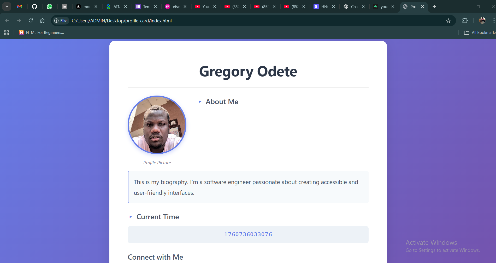

# Profile Card Component

A responsive, accessible, and interactive profile card component built with semantic HTML5, modern CSS3, and vanilla JavaScript. No frameworks, no libraries, no build tools - just pure web technologies!

## 🌟 Live Demo

**[View Live Demo →](https://youneedgreg.github.io/profile-card/)**

## 📸 Screenshots

### Desktop View


### Mobile View


## ✨ Features

### Core Requirements ✅
- **Semantic HTML5** - Proper use of `<article>`, `<header>`, `<nav>`, `<section>`, `<figure>`, and more
- **All Required Elements with data-testid**:
  - Profile card container (`test-profile-card`)
  - User name (`test-user-name`)
  - Biography paragraph (`test-user-bio`)
  - Current time in milliseconds (`test-user-time`)
  - Avatar image (`test-user-avatar`)
  - Social links navigation (`test-user-social-links`)
  - Hobbies list (`test-user-hobbies`)
  - Dislikes list (`test-user-dislikes`)
- **Real-time Timestamp** - Displays `Date.now()` in milliseconds
- **Secure Social Links** - All links open in new tabs with `target="_blank"` and `rel="noopener noreferrer"`
- **Fully Responsive** - Mobile-first design that works on all devices
- **Keyboard Accessible** - Complete keyboard navigation support
- **WCAG Compliant** - Follows web accessibility guidelines

### Enhanced Features 🚀
- **Auto-updating Time** - Timestamp updates every second
- **Interactive Elements** - Click animations on hobbies/dislikes
- **Copy Timestamp** - Click to copy timestamp to clipboard
- **Keyboard Shortcuts** - Press `/` to focus social links
- **Local Storage** - Persists uploaded avatar across sessions
- **Smooth Animations** - CSS transitions and animations throughout
- **Print Styles** - Optimized layout for printing

## 📁 Project Structure

```
profile-card/
│
├── index.html          # Main HTML file
├── styles.css          # Complete CSS styling
├── script.js           # Vanilla JavaScript 
├── README.md           # Project documentation (this file)
│
└── assets/             # Assets directory
    └── images/         # Image files
```

## 🛠️ Technology Stack

- **HTML5** - Semantic markup
- **CSS3** - Modern styling with Flexbox & Grid
- **JavaScript** - ES6+ vanilla JavaScript

## 🚀 Getting Started

### Prerequisites
- Any modern web browser (Chrome, Firefox, Safari, Edge)
- No installation or setup required!

### Local Development

1. **Clone the repository**
   ```bash
   git clone https://github.com/youneedgreg/profile-card.git
   cd profile-card
   ```

2. **Open in browser**
   - Simply open `index.html` in your web browser
   
   **Using VS Code:**
   - Install "Live Server" extension
   - Right-click `index.html` → "Open with Live Server"

## 🧪 Testing

### Manual Testing Checklist

#### Required Elements
- [ ] Profile card container has `data-testid="test-profile-card"`
- [ ] Name element has `data-testid="test-user-name"`
- [ ] Bio paragraph has `data-testid="test-user-bio"`
- [ ] Time element has `data-testid="test-user-time"`
- [ ] Avatar image has `data-testid="test-user-avatar"`
- [ ] Social links nav has `data-testid="test-user-social-links"`
- [ ] Hobbies list has `data-testid="test-user-hobbies"`
- [ ] Dislikes list has `data-testid="test-user-dislikes"`

#### Functionality
- [ ] Time displays current timestamp in milliseconds
- [ ] Time value equals `Date.now()` (within reasonable delta)
- [ ] Social links open in new tab
- [ ] Social links have `rel="noopener noreferrer"`
- [ ] Avatar has alt text for accessibility
- [ ] All interactive elements are keyboard focusable
- [ ] Focus styles are visible when using keyboard

#### Responsive Design
- [ ] Mobile layout works (<640px)
- [ ] Tablet layout works (640-1024px)
- [ ] Desktop layout works (>1024px)
- [ ] Content doesn't overflow at any breakpoint
- [ ] Text is readable at all sizes

### Browser Console Testing

Open the browser console (F12) and run these tests:

```javascript
// Test 1: Verify all required elements exist
const testIds = [
    'test-profile-card',
    'test-user-name',
    'test-user-bio',
    'test-user-time',
    'test-user-avatar',
    'test-user-social-links',
    'test-user-hobbies',
    'test-user-dislikes'
];

console.log('=== Element Verification ===');
testIds.forEach(id => {
    const element = document.querySelector(`[data-testid="${id}"]`);
    console.log(`${id}: ${element ? '✅ PASS' : '❌ FAIL'}`);
});

// Test 2: Verify timestamp is in milliseconds
const timeElement = document.querySelector('[data-testid="test-user-time"]');
const timeValue = parseInt(timeElement?.textContent);
const currentTime = Date.now();
const timeDiff = Math.abs(currentTime - timeValue);
console.log('\n=== Timestamp Test ===');
console.log(`Time element value: ${timeValue}`);
console.log(`Current Date.now(): ${currentTime}`);
console.log(`Difference: ${timeDiff}ms`);
console.log(`Test: ${timeDiff < 2000 ? '✅ PASS' : '❌ FAIL'} (should be < 2000ms)`);

// Test 3: Verify social links
const socialLinks = document.querySelectorAll('[data-testid="test-user-social-links"] a');
console.log('\n=== Social Links Test ===');
socialLinks.forEach((link, i) => {
    const hasTarget = link.target === '_blank';
    const hasRel = link.rel.includes('noopener') && link.rel.includes('noreferrer');
    console.log(`Link ${i + 1}: target="_blank" ${hasTarget ? '✅' : '❌'}, rel="${link.rel}" ${hasRel ? '✅' : '❌'}`);
});
```

## 📱 Browser Support

| Browser | Version | Status |
|---------|---------|--------|
| Chrome | Latest | ✅ Fully Supported |
| Firefox | Latest | ✅ Fully Supported |
| Safari | Latest | ✅ Fully Supported |
| Edge | Latest | ✅ Fully Supported |
| Mobile Chrome | Latest | ✅ Fully Supported |
| Mobile Safari | Latest | ✅ Fully Supported |


### Keyboard Shortcuts
- `Tab` - Navigate through interactive elements
- `/` - Focus on first social link
- `Escape` - Remove focus from current element
- `Enter/Space` - Activate buttons and links

## 📝 Code Quality

- **No ESLint errors** - Clean JavaScript code
- **Valid HTML** - Passes W3C validation
- **Valid CSS** - Passes CSS validation
- **No console errors** - Clean browser console
- **Performance optimized** - Fast load times
- **SEO friendly** - Semantic markup and meta tags

## 🚢 Deployment

### GitHub Pages

1. Push your code to GitHub
2. Go to Settings → Pages
3. Source: Deploy from branch
4. Branch: main (or master), folder: / (root)
5. Save and wait for deployment
6. Your site will be available at: `https://[username].github.io/[repo-name]/`

## 📄 License

No license.

## 👥 Author

**Your Name**
- GitHub: [@youneedgreg](https://github.com/youneedgreg)
- LinkedIn: [Gregory Temwa](https://linkedin.com/in/youneedgreg)
- Portfolio: [gregorytemwa.vercel.app](https://gregorytemwa.vercel.app)

## 🙏 Acknowledgments

- Task provided by HNG
- Inspired by modern UI/UX design principles


## 🐛 Known Issues

- None currently reported

## 🔄 Version History

- **v1.0.0** - Initial release (18/10/2025)
  - All core requirements implemented
  - Fully responsive design
  - Accessibility features
  - Auto-updating timestamp

## 📞 Support

For support, please open an issue in the GitHub repository or contact [gregorytemwa1212@gmail.com]

<div align="center">
  
**Built with ❤️ using HTML, CSS, and Vanilla JavaScript**

[View Demo](https://youneedgreg.github.io/profile-card/)

</div>